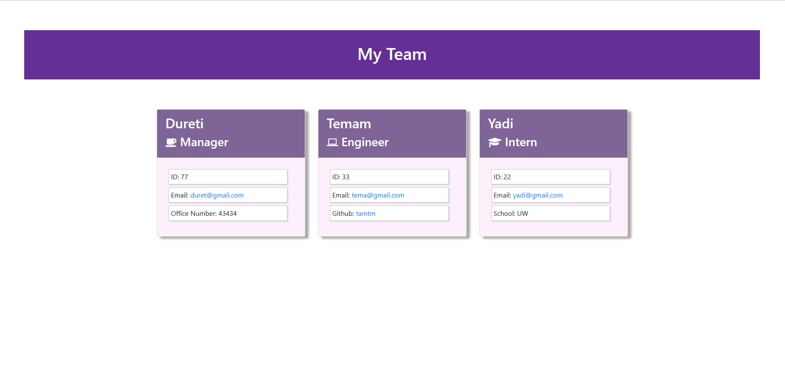
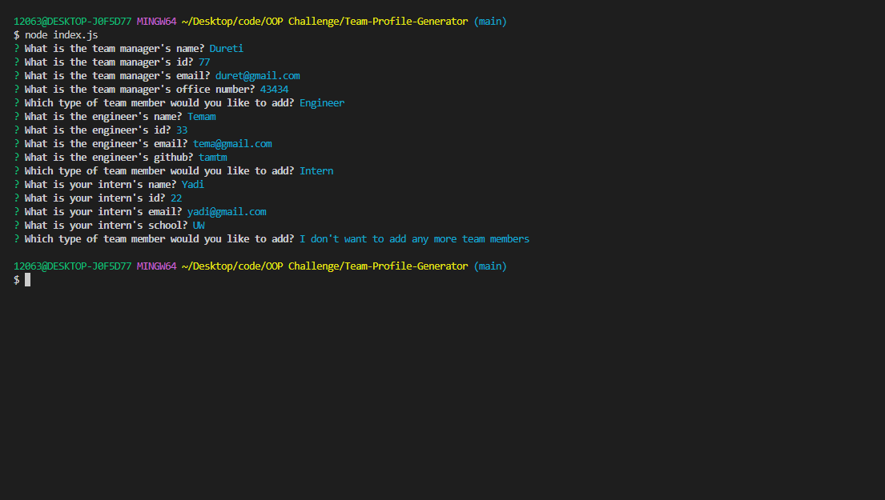

# Team-Profile-Generator
## Table of Content
- [Description](#description)
- [Links](#links)
- [Screenshots](#screenshots)
- [Test](#test)
- [License](#license)
- [Questions](#questions)
-------------------------------------
## Description
This application generates a team profile using Node.js commad-line. The Node.js command line application takes in inforamation provided about employees on software engineering team and generates a webpage containing specified information for each team member. 
To implement this appliction inquirer package is used to collect input from the user and also Jest(A JavaScript testing framework designed to ensure correctness of any JavaScript codebase) is used for running unit tests. 

--------------------------------------

## Links
   Walkthrough video: https://drive.google.com/file/d/19oWZMouO55Cix86BJA64CNNVrnYlg0ut/view

## Screenshots

## Test 

The application is invoked by using "node index.js" command.
   
---------------------------------------
## License 
MIT License

## Questions

-Contact me:

  - Email Address: duretikadir22@gmail.com
 
  - Github Profile: duretitilmo

------------------------------------------
&copy 2023